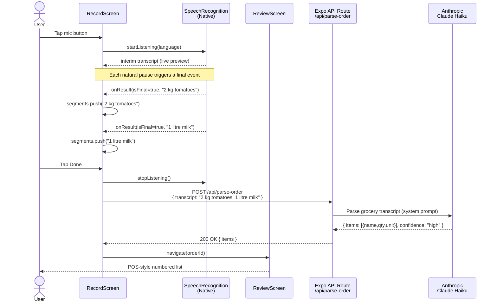
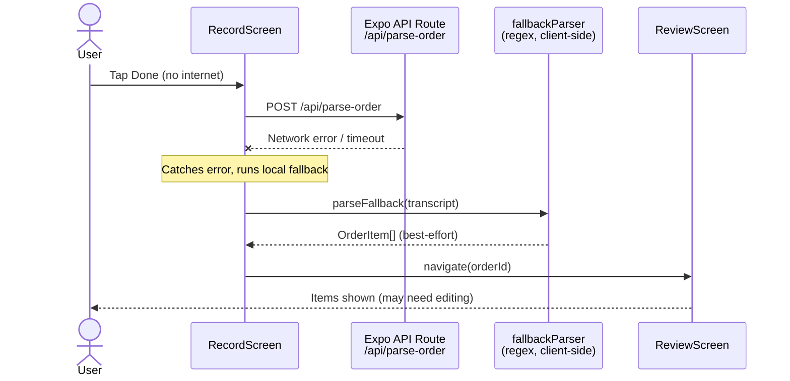
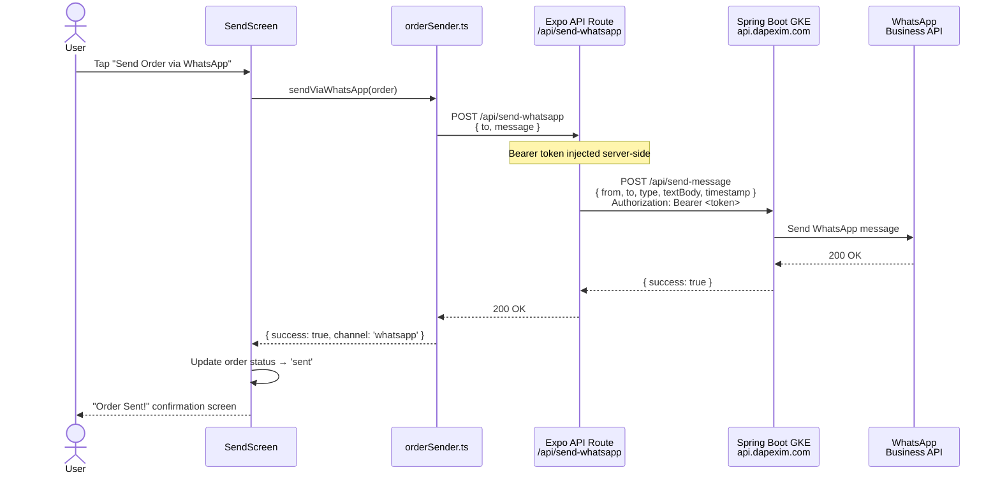
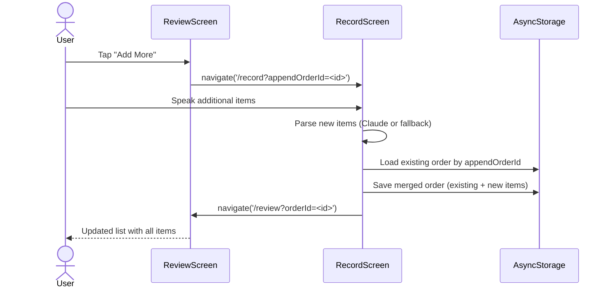
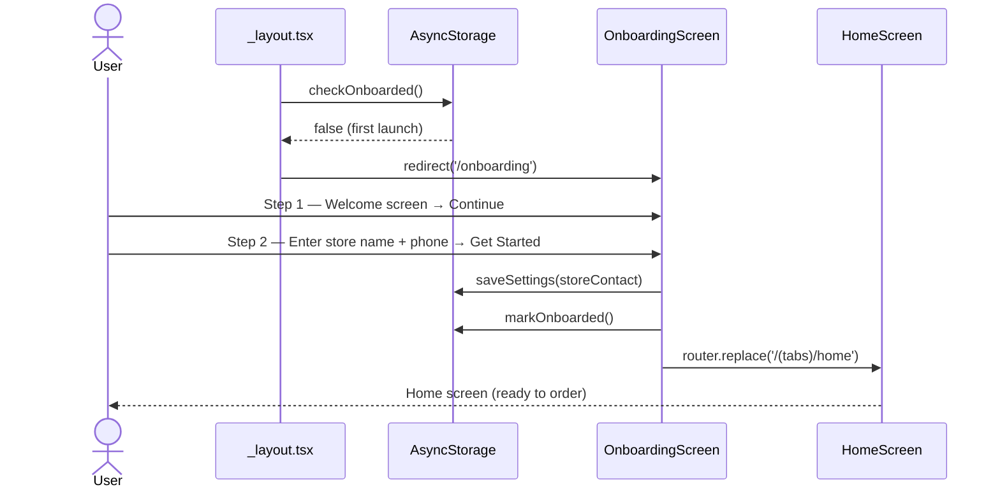

# Kirana — Architecture & Sequence Diagrams

## High-Level Architecture

```
┌─────────────────────────────────────────────────────────┐
│                   Android Device                        │
│                                                         │
│  ┌─────────────────────────────────────────────────┐   │
│  │              React Native (Expo)                 │   │
│  │                                                  │   │
│  │   RecordScreen  →  ReviewScreen  →  SendScreen   │   │
│  │        │                                 │       │   │
│  │   useSpeechRecognition            sendViaWhatsApp│   │
│  │   (expo-speech-recognition)               │      │   │
│  └───────────────────────────────────────────┼──────┘   │
│                  │ POST /api/parse-order      │          │
│                  │ POST /api/send-whatsapp    │          │
└──────────────────┼────────────────────────────┼──────────┘
                   │                            │
         ┌─────────▼──────────┐      ┌──────────▼──────────┐
         │   Expo API Routes  │      │   Expo API Routes   │
         │  (Node.js, server) │      │  (Node.js, server)  │
         │  parse-order+api   │      │  send-whatsapp+api  │
         └─────────┬──────────┘      └──────────┬──────────┘
                   │                            │
         ┌─────────▼──────────┐      ┌──────────▼──────────┐
         │   Anthropic API    │      │  Spring Boot GKE    │
         │   Claude Haiku     │      │  WhatsApp Service   │
         │  (AI order parse)  │      │  api.dapexim.com    │
         └────────────────────┘      └─────────────────────┘
                                               │
                                     ┌─────────▼──────────┐
                                     │  WhatsApp Business  │
                                     │       API           │
                                     └─────────────────────┘
```

---

## Component Architecture

```
mobile/
├── app/                           [Expo Router screens]
│   ├── (tabs)/
│   │   ├── home.tsx               HomeScreen
│   │   │     └── OrderSummaryCard (recent orders list)
│   │   ├── history.tsx            OrderHistoryScreen
│   │   └── settings.tsx           SettingsScreen
│   │         └── Field (reusable input)
│   ├── api/
│   │   ├── parse-order+api.ts     ← Claude API key lives here only
│   │   └── send-whatsapp+api.ts   ← Bearer token lives here only
│   ├── record.tsx                 RecordScreen
│   │     ├── MicrophoneButton
│   │     └── useSpeechRecognition hook
│   ├── review.tsx                 ReviewScreen
│   │     └── OrderItemRow (inline editable)
│   ├── send.tsx                   SendScreen
│   │     └── SendChannelPicker
│   └── onboarding.tsx             OnboardingScreen (first launch)
│
└── src/
    ├── hooks/
    │   ├── useSpeechRecognition   Native speech, segments[]
    │   ├── useOrderParser         Calls /api/parse-order
    │   ├── useOrderHistory        AsyncStorage CRUD
    │   └── useSettings            AsyncStorage settings
    ├── services/
    │   ├── claudeParser           Claude Haiku prompt + Zod validation
    │   ├── orderFormatter         Text / HTML message templates
    │   ├── orderSender            WhatsApp API / SMS / Email / Copy
    │   └── storage                AsyncStorage keys + serialization
    ├── models/
    │   ├── order.ts               Order, OrderItem, StoreContact types
    │   ├── settings.ts            AppSettings, SPEECH_LANGUAGES
    │   └── schemas.ts             Zod schemas for API responses
    └── utils/
        ├── fallbackParser         Regex parser (offline mode)
        └── idGenerator            nanoid-based ID generation
```

---

## Sequence Diagrams

### 1. Voice Order — Happy Path (Claude AI available)



---

### 2. Voice Order — Offline Fallback



---

### 3. Send Order via WhatsApp (Direct API)



---

### 4. Add More Items to Existing Order



---

### 5. First Launch Onboarding



---

## Data Flow

```
User Speech
    │
    ▼
expo-speech-recognition (native OS)
    │  isFinal events per pause
    ▼
segments: string[]          ← one item per pause
    │
    ▼
POST /api/parse-order       ← Expo API Route (server)
    │
    ├─ Claude Haiku ──────► { items, confidence }
    │                                │
    └─ fallbackParser (offline) ─────┘
                                     │
                                     ▼
                               OrderItem[]
                                     │
                           AsyncStorage (draft order)
                                     │
                                     ▼
                            ReviewScreen (edit)
                                     │
                                     ▼
                         POST /api/send-whatsapp
                                     │
                         Spring Boot GKE → WhatsApp
                                     │
                           order.status = 'sent'
                                     │
                           AsyncStorage (history)
```

---

## Security Model

| Secret | Location | Accessible by |
|--------|----------|--------------|
| `CLAUDE_API_KEY` | `.env.local` (server) | Expo API Route only |
| `WHATSAPP_BEARER_TOKEN` | `.env.local` (server) | Expo API Route only |
| `WHATSAPP_FROM_NUMBER` | `.env.local` (server) | Expo API Route only |
| `EXPO_PUBLIC_API_URL` | `.env.local` (client-safe) | App bundle |
| Store phone/name | AsyncStorage | App only, on-device |

API keys never leave the server-side Expo API Routes and are never bundled into the client app.

---

## Environment Variables

| Variable | Side | Purpose |
|----------|------|---------|
| `CLAUDE_API_KEY` | Server | Anthropic API authentication |
| `WHATSAPP_API_URL` | Server | GKE WhatsApp service endpoint |
| `WHATSAPP_BEARER_TOKEN` | Server | GKE service authentication |
| `WHATSAPP_FROM_NUMBER` | Server | Sender WhatsApp number |
| `EXPO_PUBLIC_API_URL` | Client | Dev server LAN IP for API calls |
